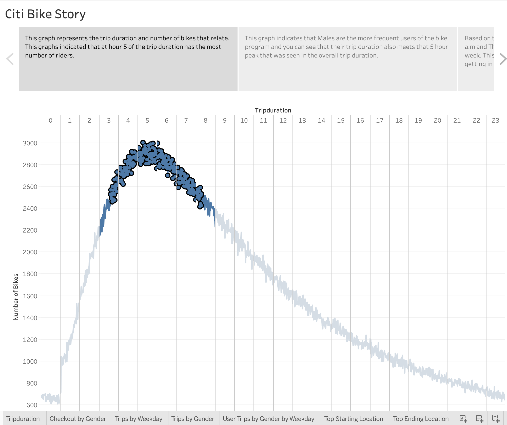

# Bike_Sharing

## Overview
The Citi Bike program allows customers to checkout a bike and ride it around the city and return it when they are finished. This analysis was to look at the data collected from the Citi Bike program in New York to convince investors to fund a bike program in Des Moines. These viualizations show different data points from the New York investors.

## Results
In this Tableau story contains different graphs based on data point collected from the New York City citibike program.

[link to dashboard](https://public.tableau.com/profile/harishawn.ramrup#!/vizhome/CitiBikeAnalysis_16034992220820/CitiStory "link to dashboard")

## Summary 

The data showed that the areas within New York that were the most popular also had a time period where the bike usage was more popular. It was around 8 am and 5-6 pm where the bike usage amoung males were the most popular. The areas where bike trips began and where the trips ended could also be related to where the primary offices are and where the apartments and residental area are located. Another visualization that would help with the investors prospecting for Des Moines bike program is mapping where the residential areas are in Manhattan and where the trips start and end from. Another visualization would be to compare the lifetime of a bike and how much it produces in revenue for the investors to have a finacial visualization. 
